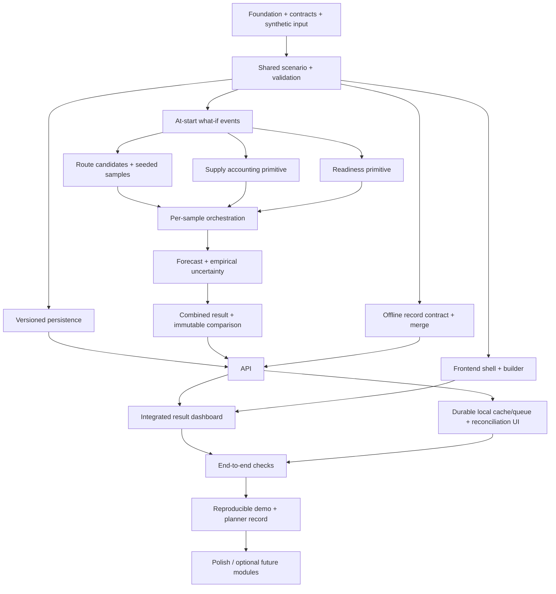

# MAYA live implementation plan

Date: 2026-10-02. Source baseline: `sources/prd.md` v0.2 and the design documents
in `sources/`. Initial evidence: `docs/engineering_audit.md`.

## 1. Executive summary

Deliver one fictional, seeded what-if logistics simulation, not a dashboard of
unrelated numbers. Build transparent formulas before optional ML. The planner
reviews options and records a decision; nothing executes operationally.

## 2. Current repository state

At takeover: four source documents and five skill/catalog files, no application.
Three older tracked root documents are user-deleted; preserve those deletions.
No test/build commands, package lock, database or deployment exists initially.
This root plan tracks implementation without replacing the source design plan.

## 3. Architecture discovered from code

No code exists at audit time. The following is **proposed implementation**, based
on documented logical boundaries, not a description of discovered software:

- Python/FastAPI/Pydantic API and versioned shared scenario/result models.
- Pure routing/readiness/supply functions composed by one simulation orchestrator.
- Standard-library seeded Monte Carlo, transparent deterministic baseline.
- SQLAlchemy persistence; local SQLite default, PostgreSQL-compatible configuration.
- Next.js App Router/TypeScript planner frontend (historical frontend's framework).
- Small durable browser local store/queue with backend version/integrity checks.
- Separate API, domain, persistence and presentation; no frontend prediction math.

Decisions/conflicts and proposed departures are explained in the initial audit.

## 4. Existing capabilities

Only documentation and methodology exist initially. No runtime capability is
IMPLEMENTED or PROTOTYPE before the P0 work below. Subsequent status must have
code evidence and actual checks.

## 5. Missing capabilities

All runtime subsystems: shared schema, events, routes, supply, readiness,
uncertainty, combined results, API, persistence, builder/dashboard, offline queue,
reconciliation, planner record, tests and runnable demo. Authentication and public
deployment are missing; they are not implied by a local demonstrator.

## 6. Technical gaps

- Lock hour/day/quantity units, thresholds, supported events, failure semantics.
- Exact arrival/critical-time handling, demand=0 and shortage accounting.
- Distinguish simulated success fraction, percentile bands and confidence intervals.
- Snapshot exact inputs/seed/model configuration per run; compare immutable runs.
- Version-aware persistence and idempotent sync without silent conflict winners.
- Resource feasibility must govern delivery, not only paint readiness cards.
- No source frontend document in working tree; use historical Next.js choice,
  current PRD experience and installed frontend methodology, not C2 scope.

## 7. Dependency graph

Parallel lanes after contract lock: domain engines; frontend presentation/cache;
integration-owned API/storage/reconciliation. Each lane owns disjoint files.
Tests accompany every node; final integration testing is a gate, not the first test.

## 8. Development phases

- Phase 0 / P0: audit, contracts, bounded run parameters, synthetic fixture.
- Phase 1 / P0: shared scenario, events, deterministic route/supply/readiness.
- Phase 2 / P0: coupled samples, forecasts, actual percentile bands and assumptions.
- Phase 3 / P0: immutable persistence, API, comparison, frontend integrated loop.
- Phase 4 / P0: reload-safe offline queue, integrity/version checks and visible conflicts.
- Phase 5 / P0: tests, performance measurement, reproducible demo, human decision.
- P1: complete CRUD/clone/reset, expanded events, PostgreSQL migrations/checks,
  graph route generation, richer demand baselines and browser automation coverage.
- P2: visual polish/export, optional simulated Ghost Convoys only after core stability.
- P3: calibrated models, public deployment/auth, approved open datasets, robust
  multi-device synchronization. No operational/military control integrations.

## 9. Task breakdown and acceptance/status

- F0 **P0 DONE**: recursively inspect/read all files; audit and live plan saved.
- F1 **P0 TODO** (F0): Python tooling, schema, fixture; invalid/nonfinite values,
  duplicate IDs and invalid relationships rejected. Exact supported units documented.
- D1 **P0 TODO** (F1): at-start route delay/unavailable/demand/environment events;
  no mutation of baseline; unsupported event timing fails explicitly.
- D2 **P0 TODO** (D1): candidate routes, resource constraints, sample reproducibility.
- D3 **P0 TODO** (F1, parallel D2): stock conservation, reserved stock, inbound
  at arrival, depletion, critical/stockout times, shortage; tests for boundaries.
- D4 **P0 TODO** (F1, parallel D2): configurable readiness factors, score/timeline,
  threshold and overload feasibility; test monotonicity.
- D5 **P0 TODO** (D2–D4): per-sample coupling, ranked feasible options, sample
  bands, censored critical outputs, ledger, exact input snapshot and combined deltas.
- A1 **P0 TODO** (F1, parallel D2–D4): transactional repositories and scenario/run
  readback, version conflicts; local DB restart persistence.
- A2 **P0 TODO** (A1,D5): documented API models, errors and combined comparison.
- U1 **P0 TODO** (F1, parallel D2–D4): Next.js builder/result components, typed
  API client; loading/empty/error/success states and accessible labels.
- U2 **P0 TODO** (A2,U1): baseline→event→rerun shows route/ETA/readiness/stock
  differences from backend, no hardcoded output or duplicate business logic.
- O1 **P0 TODO** (F1, parallel D2): typed records, checksum/version checks,
  atomic idempotent reconcile; unresolved conflicts never marked synced.
- O2 **P0 TODO** (O1,U1): cached scenario/manifest/inventory/readiness/status,
  local mutation+queue, reload persistence, reconnection and explicit resolution.
- T1 **P0 TODO** (all P0): real unit/API/type/lint/build checks, deterministic
  full-flow run, 1,000-sample measurement and remaining-gap report.
- T2 **P0 TODO** (T1): demo procedure and explicit simulated planner option record.

No subsystem is promoted to complete based on its endpoint or UI alone.

## 10. File/module ownership

- Integration owner: `backend/app/models.py`, `backend/app/api/`,
  `backend/app/storage/`, `backend/app/reconciliation/`, `backend/app/main.py`,
  `backend/pyproject.toml`, API/reconciliation tests, `data/`, README, live plan.
- Domain implementation lane: `backend/app/core/`, `backend/app/routing/`,
  `backend/app/supply/`, `backend/app/readiness/`, `backend/app/uncertainty/`,
  domain unit tests. Do not alter schema without integration-owner agreement.
- Frontend implementation lane: `frontend/` only. Consume frozen API contracts;
  no backend formula replication. Browser cache is presentation/data transport.
- Initial documents/skills: read-only; audit additions in `docs/`.

## 11. API requirements (contract refinement, not pre-existing APIs)

Use source plan `/api` namespace. Initial increment:

- `GET /api/health`: local demo scope/health.
- `POST /api/scenarios`: validated Scenario, durable readback.
- `GET /api/scenarios/{id}` and `PUT`: full typed snapshot/version conflict handling.
- `POST /api/scenarios/{id}/clone`: independent baseline/what-if copy.
- `POST /api/scenarios/{id}/events`: explicit typed event, expected version.
- `POST /api/simulations`: scenario ID, bounded sample count; seed lives in scenario.
- `GET /api/simulations/{run_id}`: immutable snapshot plus combined output.
- `POST /api/simulations/{run_id}/compare`: baseline run ID; backend calculates diff.
- `POST /api/sync/reconcile`: typed record updates/base version/payload digest;
  return accepted/duplicate/conflicting/invalid, latest record and audit trail.
- Record readback/creation endpoints for the concrete local resilience prototype
  are **proposed additions**, explicitly documented in OpenAPI/README.
- Planner decision endpoint is a **proposed addition**: store run+feasible route
  plus note, never execute anything.

Invalid input 422, absent entities 404, duplicate/version conflicts 409. Bounded
simulation workload. No wildcard CORS or network-exposed no-auth service.

## 12. Database requirements

SQLAlchemy repositories: versioned scenario JSON, immutable run snapshot/result,
typed sync records, unique mutation receipts and planner decisions. JSON results
are permitted by source plan §16. All writes transactional; retries idempotent.
SQLite local default is a disclosed prototype convenience; PostgreSQL configuration
does not count as PostgreSQL verification. Schema migrations/backups and concurrent
PostgreSQL tests are P1 before any durable hosted deployment.

## 13. ML requirements

No training or LLM is required for P0. Deterministic fixed-demand baseline plus
sampled route delay/demand = simulation forecast, not trained ML or calibrated
real-world prediction. Candidate optional ML must define inputs/output, fixed
baseline, held-out MAE/RMSE/interval coverage, versioned synthetic/open data,
training/inference cost, deterministic fallback and explanations before promotion.
No invented accuracy, confidence, datasets or validated readiness coefficients.

## 14. Frontend requirements

One builder/dashboard workflow: editable synthetic scenario inputs, baseline run,
at-start disruption selector, rerun, causal change summary, route trade-offs,
stock timeline+critical/stockout dates, readiness factors, P10/P90 interpretation,
assumptions, seed/snapshot, local connectivity/cache/queue/conflicts and a human
decision record. Browser must not recompute forecasts. Use responsive components,
text status alongside color, labelled controls and explicit API failures.

## 15. Testing strategy

Python: pytest unit/API tests, ruff formatting/lint and mypy typed domain checks.
Frontend: TypeScript, lint/build and meaningful pure queue lifecycle tests;
real browser baseline/event/offline/reload demo where tooling permits. Never
replace actual tests with claims or count a build as browser verification.

Required edges: initial critical stock, zero demand, within-step arrival,
simultaneous threshold/arrival, demand spike, full route closure, overload,
unreachable inbound, reserved stock, horizon censoring, fixed seed/changed seed,
ordered sample percentiles, unsupported future events, stale writes, duplicate
sync, tampered digest, missing fields, conflicted updates retained after reload,
nonconflicting field merge and transactional decision validation.

## 16. Performance requirements

PRD target: typical 1,000-run route simulation under 60 seconds. Measure elapsed
time, route/sample/timestep counts and environment on the implemented fixture.
Start synchronous; bound horizon/sample/route sizes to avoid unbounded API work.
Do not add workers/Redis/vectorization until measurement justifies them. Frontend
build size and reconciliation latency should be recorded, not fabricated.

## 17. Demo requirements

Fictional origin/destination, three explicit candidate paths, generic supply units,
one resource group, stock/demand/thresholds, 120h horizon and fixed seed. Fixture
numbers are inputs, never output literals. Baseline arrival before critical stock;
closing/delaying the preferred candidate forces later delivery and a changed
critical point/readiness. Show no-route/no-feasible option honestly.

Sequence: load/create → baseline → close route → rerun → inspect causal deltas and
uncertainty → disconnect → local write → reload → reconnect → reconcile → inspect
conflict/choose resolution → record human choice. No Ghost Convoy dependency.

## 18. Risk register

- R1 HIGH: hidden unit/arrival semantics → explicit model and conservation tests.
- R2 HIGH: uncalibrated readiness → documented configurable toy coefficients.
- R3 HIGH: fake percentile/probability → actual samples and interval labels.
- R4 HIGH: conflict/queue loss → durable local store, CAS and idempotent receipts.
- R5 HIGH: no-auth network exposure → loopback-only instructions; public auth gate.
- R6 MEDIUM: missing skill references/frontend doc → disclose absence, no invented loads.
- R7 MEDIUM: Python 3.14 package support → locked supported dependency versions;
  report environment installation failures instead of changing global settings.
- R8 MEDIUM: SQLite vs recommended PostgreSQL → explicit local prototype boundary,
  configure portable SQLAlchemy, PostgreSQL verification pending.
- R9 MEDIUM: frontend/backend contract drift → shared schema owner, API tests,
  reject unknown request fields and actual integration checks.
- R10 MEDIUM: scope creep → block advanced ML/Ghost Convoys until P0 demo gates pass.

## 19. Definition of Done

One saved seeded scenario can run baseline/event variants and show real coupled
route/ETA/readiness/stock/critical deltas with input assumptions and sample ranges.
Offline writes survive reload and resolve or visibly remain conflicted; record
integrity/version checks are inspectable. Human decision is a stored simulation
annotation, not execution. Unit/integration/type/lint/build checks actually pass,
runtime target is measured, demo is documented, real limitations stay visible.
Complete MVP is not claimed until the browser demo is verified.

## 20. Immediate next actions

1. Lock `models.py`, API contract and synthetic input before delegation.
2. Start two independent implementation lanes (domain and frontend); integration
   owner handles API/storage/reconciliation/tests. No investigation delegated.
3. Gate domain correctness and API persistence before final UI integration.
4. Run checks, fix findings, update this plan with file evidence and blockers.

## Execution evidence / blockers

Initial evidence: recursive inventory and full reads of nine working files plus
three historical root documents. No pre-existing check command could be run.
Potential blocker: absent current frontend document/skill reference companions;
not blocking a minimal documented Next.js simulation frontend. PostgreSQL service,
calibrated ML data and production authentication are not available/required for
the initial local simulation increment and must not be claimed as verified.
